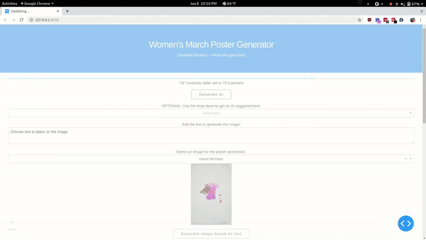
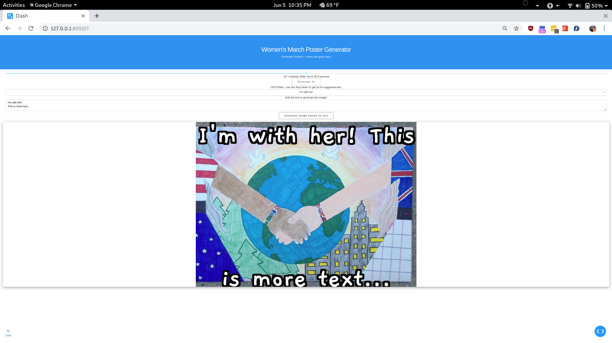

# Womens March Poster Generator
Using a neural network, generates women's march poster images. This was done in collaboration with
the Northeastern School of Journalsim and the Art of the March.

Example poster creation:

UI:

Requires Textgenrnn, Dash, and Pillow

Posters sourced from http://artofthemarch.boston